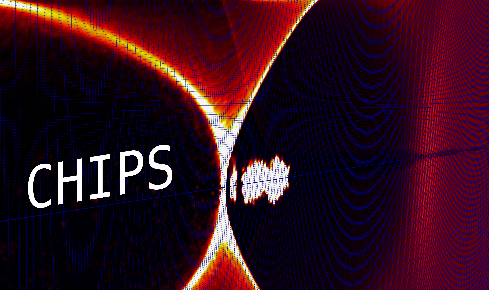

# Computational High Intensity Plasma Science

Welcome to the CHIPS website. This research group is interested in all aspects of computational plasma physics for advanced accelerators, laser fusion, extreme astrophysics, high intensity laser and particle beams...

This website is very much a work in progress...
---

## Code development
- [OSIRIS local dev fork](https://github.com/alecgrthomas/osiris)
- [IMPACTA collisional electron transport](https://github.com/alecgrthomas/impacta)
- [RDTX radiation spectrum calculation](https://github.com/alecgrthomas/rdtx)
- [ATSV spectral/exponential integrator for Vlasov code](https://github.com/alecgrthomas/atsv)

# Other useful code
- [EPOCH particle-in-cell code](https://github.com/epochpic/epoch)
- [FLASH rad-hydro code](https://flash.rochester.edu/site/flashcode.html)

## Analysis tools
- [PyVisOS local dev fork](https://github.com/alecgrthomas/pyVisOS)

## Contact

[agrt@umich.edu](mailto:agrt@umich.edu).

---
